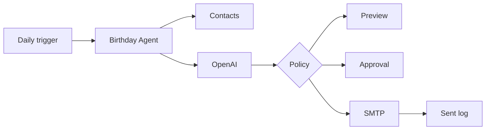

# Birthday Agent 🎂

A small, safe-by-default MVP that finds today's birthdays, uses an OpenAI model to write a personalized message, and can preview, approve, or automatically send it by email.

The interesting design choice is that **automatic does not always mean agentic**. The daily birthday check is deterministic; the AI layer personalizes the message. This MVP is deliberately simple so it can be extended later with more dynamic tool choice, memory, channel selection, and ML-driven ranking or timing.

## Choose your path

| Path | Best for | Stack | Start here |
|---|---|---|---|
| No-code | Readers who want to build it without programming | Google Sheets + Zapier + OpenAI + Gmail | [`no-code/README.md`](no-code/README.md) |
| Technical | Developers who want the code and extension points | Python + OpenAI Responses API + SMTP | Continue below |

Both paths use only fake data in this public repository. Put real contact information and credentials in your own private tools, never in a fork or public commit.

## Architecture



See `docs/architecture.md` for the Python component breakdown, or `docs/architecture-no-code.md` for the no-code workflow.

## Where to put your material

| Material | Location | Share publicly? |
|---|---|---|
| Real names, birthdays, email addresses, relationship notes | `data/contacts.csv` | **No** |
| Sample/fake contacts | `data/contacts.example.csv` | Yes |
| No-code fake template | `no-code/birthday-agent-template.csv` | Yes |
| No-code setup guide and prompt | `no-code/` | Yes |
| OpenAI and email credentials | `.env` | **No** |
| Safe placeholder configuration | `.env.example` | Yes |
| Writing style / agent prompt | `prompts/birthday_message.txt` | Yes |
| Architecture | `docs/architecture.md` | Yes |
| Code and tests | `src/`, `tests/` | Yes |
| Send history | `data/sent_log.csv` | **No** |

The `.gitignore` already protects the private files above. Still, check your repo before publishing it.

## Technical MVP

### 1. Set up

```bash
python -m venv .venv
source .venv/bin/activate
python -m pip install -e .
cp .env.example .env
cp data/contacts.example.csv data/contacts.csv
```

On Windows, activate the virtual environment with `.venv\\Scripts\\activate`.

### 2. Add your birthday data

Edit `data/contacts.csv`:

```csv
name,birthday,email,relationship,context,tone
Maya,08-07,maya@example.com,former coworker,"We worked together for three years and she loves hiking.",warm
```

Birthday format is `MM-DD`, so you do not need to store birth years.

Keep context short and only store information you are comfortable using for personalization.

### 3. Configure OpenAI

Put your API key in the environment or your private `.env` file:

```text
OPENAI_API_KEY=...
OPENAI_MODEL=gpt-5.6-luna
SENDER_NAME=Your Name
SENDER_STYLE=Warm, genuine, concise, personal, and natural.
```

The code uses the OpenAI Responses API. The current default model is `gpt-5.6-luna`, which is a good fit for a short, cost-sensitive text-generation task. You can change it in `.env`.

Never commit `.env` or paste API keys into public code.

### 4. Preview first

Test the entire workflow without an API call:

```bash
birthday-agent --date 2026-08-07 --template
```

Then test real AI-generated messages in preview mode:

```bash
birthday-agent --date 2026-08-07
```

Preview is the default and cannot send anything.

### 5. Configure email delivery

Add SMTP settings only when you are ready to test sending:

```text
SMTP_HOST=your.smtp.host
SMTP_PORT=587
SMTP_USERNAME=...
SMTP_PASSWORD=...
FROM_ADDRESS=you@example.com
```

Use credentials designed for application access. Do not reuse or publish your normal email password.

### 6. Send with approval

```bash
birthday-agent --date 2026-08-07 --mode approve
```

The message is shown first. You must type `y` before it is sent.

### 7. Enable automatic sending

After you have tested preview and approval modes, set:

```text
AUTO_SEND_ENABLED=true
```

Then:

```bash
birthday-agent --mode auto
```

There are two gates: the CLI must explicitly request `auto`, and `AUTO_SEND_ENABLED` must be `true`.

To make it automatic every day, schedule that command with cron, Task Scheduler, GitHub Actions, or another scheduler. For example, a local cron entry for 9:00 AM might run the installed `birthday-agent --mode auto` command from this project environment.

### 8. Run tests

```bash
PYTHONPATH=src python -m unittest discover -s tests -v
```

## MVP boundaries and next versions

Version 1 intentionally uses a local CSV and one delivery channel.

Good next steps:

1. Pull birthdays from a calendar or CRM instead of CSV.
2. Add time zones and recipient-specific send times.
3. Add multiple tools/channels and let the agent select among them.
4. Add memory of previous birthday messages so wording does not repeat.
5. Add retries, monitoring, and delivery-status tracking.
6. Add an ML model only where it earns its complexity—for example, ranking the best communication time or channel at larger scale.

## Privacy note

Do not publish real contact data, private relationship notes, API keys, SMTP credentials, or send logs with the demo. The repository is designed so only fake/sample data needs to be shared.
