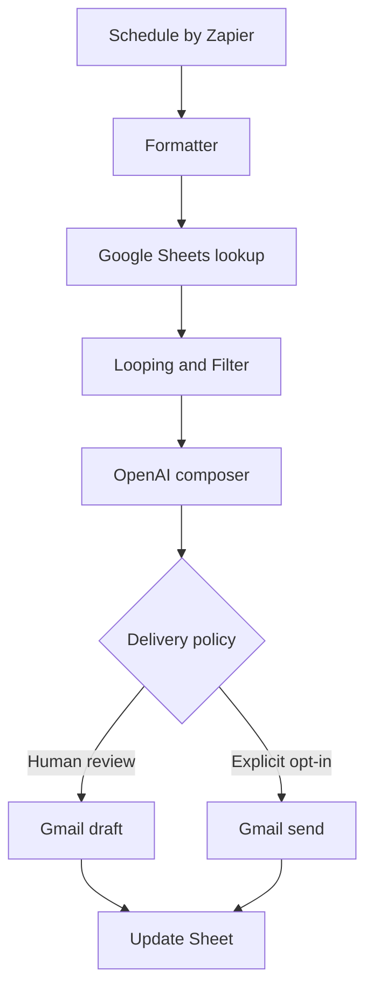

# No-code Birthday Message architecture

The no-code version keeps the schedule and safety rules deterministic while using an AI model only for message composition.

## Components and responsibilities

| Component | Responsibility | Why it is separate |
|---|---|---|
| Schedule by Zapier | Starts the workflow once a day | Keeps timing predictable and inspectable |
| Formatter | Produces today's `MM-DD` and current `YYYY` | Avoids putting date logic in the AI prompt |
| Private Google Sheet | Stores contacts, preferences, and duplicate state | Keeps real data out of the public repository |
| Advanced lookup | Returns every row matching today's birthday key | Supports multiple birthdays on the same date |
| Looping and Filter | Processes each match and enforces `enabled` plus duplicate rules | Prevents the model from deciding authorization |
| OpenAI composer | Writes one personalized message from bounded inputs | Uses AI where language variation is useful |
| Gmail draft or send | Applies the chosen delivery policy | Makes human review the safe default |
| Sheet update | Records `last_processed_year` after success | Prevents a second action for the same person that year |

## Trust boundaries

- The GitHub repository contains fake data, the reusable prompt, documentation, and code only.
- Real contact data stays in the builder's private Google Sheet.
- Google and OpenAI credentials stay inside their connection managers; they are never stored in a Sheet cell or repository file.
- The model composes text. It does not decide who is enabled, whether a duplicate is allowed, or which email address receives the result.
- The `last_processed_year` update happens only after Gmail reports success, preserving retry behavior after a failure.

## Automation versus agency

Version 1 follows a fixed path and is therefore an AI-enhanced workflow rather than a highly autonomous agent. A later version can add bounded choices—channel selection, send-time optimization, memory retrieval, or approval escalation—without giving the model authority over privacy and duplicate-prevention rules.
