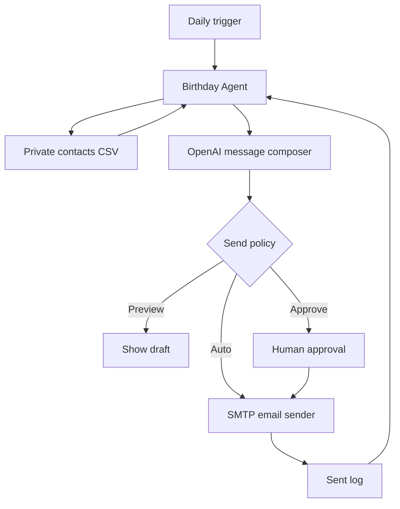

# Birthday Agent MVP architecture

The MVP intentionally separates private data, AI personalization, delivery, and safety policy.

## Components

- **Daily trigger:** cron, Task Scheduler, or another scheduler runs the CLI once a day.
- **Private contacts:** `data/contacts.csv`; deliberately excluded from source control.
- **Message composer:** OpenAI Responses API creates the personalized draft from a prompt and contact context.
- **Send policy:** preview is the default; approve requires a person; auto must be explicitly unlocked.
- **Delivery:** SMTP in the MVP. This is an adapter and can later be replaced with another channel.
- **Sent log:** prevents duplicate sends for the same recipient on the same date.

## Why this is an MVP

The daily path is intentionally constrained. Future versions can add calendar/contact APIs, tool-based channel selection, richer memory, retries, user-specific time zones, and agent-driven decisions about when an action requires approval.

