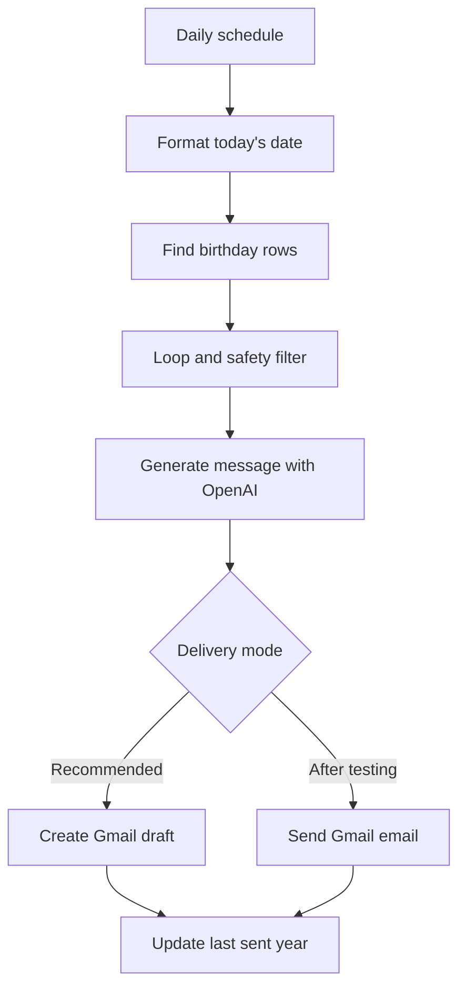

# Build the Birthday Message Workflow Without Code

This version is for anyone who wants to build the idea without programming. It uses:

- **Google Sheets** to hold birthday details.
- **Zapier** to run the workflow every day.
- **OpenAI** to write a short, personalized message.
- **Gmail** to create a draft by default, or send automatically after testing.

This MVP is best described as an **AI-powered automation**: the path is predefined, while the AI generates the wording. It can become more agentic later by choosing tools, channels, timing, and approval policies dynamically.

## What you need

- A Google account with Google Sheets and Gmail.
- A Zapier account. This workflow has multiple actions, a filter, and a loop, so feature availability may depend on your Zapier plan.
- Access to the ChatGPT (OpenAI) app in Zapier.
- An OpenAI API account if your Zapier connection asks for an API key.

Never put an API key, password, or real contact information in this repository.

## Architecture

See [`../docs/architecture-no-code.md`](../docs/architecture-no-code.md) for the role of every component.

## 1. Create your private Google Sheet

1. Download [`birthday-agent-template.csv`](birthday-agent-template.csv).
2. In Google Sheets, create a new spreadsheet.
3. Select **File → Import → Upload**, choose the CSV, and import it as a new sheet.
4. Rename the worksheet tab to `Birthdays`.

Keep the first-row headers unchanged:

| Column | Purpose | Example |
|---|---|---|
| `name` | Name used in the greeting | `Maya` |
| `birthday_key` | Month and day only, in `MM-DD` format | `08-07` |
| `email` | Delivery address | `maya@example.com` |
| `relationship` | Small personalization clue | `former coworker` |
| `context` | One short, non-sensitive detail | `She loves hiking.` |
| `tone` | Desired writing style | `warm` |
| `enabled` | Whether the workflow may act on this row | `yes` |
| `last_processed_year` | Duplicate-prevention field; initially blank | `2026` |

The repository template uses invented names and reserved `example.com` addresses. Make a **private** Sheet for real data; do not add your real Sheet or an export of it to GitHub.

Select the entire `birthday_key` column and choose **Format → Number → Plain text**. Verify that values still display exactly as `08-07`, including the leading zero. If Google Sheets converted a value to a calendar date, set the column to plain text and re-enter that value.

## 2. Create the daily trigger

1. In Zapier, create a new Zap.
2. Choose **Schedule by Zapier** as the trigger.
3. Choose **Every Day**.
4. Select a time of day and allow weekends so birthdays on Saturday or Sunday are not skipped.
5. Confirm the timezone in your Zapier account and in this step.
6. Test the trigger.

## 3. Format today's birthday key

Add **Formatter by Zapier**:

1. Choose **Date / Time** and the **Format** transform.
2. For input, map the schedule's current timestamp or Zapier's current-time system value.
3. Set the output to the custom format `MM-DD`.
4. Set the output timezone to your intended birthday-check timezone.
5. Test the result. It should look like `08-07`.

Add a second Formatter step using the same input and output format `YYYY`. Its result is the current year used to prevent duplicates.

## 4. Find everyone whose birthday is today

Add a **Google Sheets** action:

1. Choose **Lookup Spreadsheet Rows (Advanced)**.
2. Connect your Google account.
3. Select your private spreadsheet and the `Birthdays` worksheet.
4. Set the lookup column to `birthday_key`.
5. Map the `MM-DD` output from the Formatter step as the lookup value.
6. Return the results as line items, including the row number or row ID.
7. Test the lookup.

The advanced lookup supports multiple matches, which matters when several people share a birthday. Configure the search to stop cleanly when no rows match rather than creating a new row.

## 5. Loop through matching rows

Add **Looping by Zapier**:

1. Choose **Create Loop From Line Items**.
2. Map every returned field you need: row number, name, email, relationship, context, tone, enabled, and last sent year.
3. Test the loop with one fake matching row.

All actions placed after this step run once for every matching person.

## 6. Add the safety filter

Add **Filter by Zapier** immediately after the loop. Continue only when both conditions are true:

1. The loop's `enabled` value exactly matches `yes`.
2. The loop's `last_processed_year` does **not** match the formatted current year.

This prevents disabled rows and repeat drafts or sends in the same year. Map fields from the **loop output**, not directly from the earlier Google Sheets lookup.

## 7. Generate the message

Add the **ChatGPT (OpenAI)** app and choose its text-generation action. Zapier's available action name can change; select the action that accepts instructions or a prompt and returns generated text.

1. Connect the OpenAI account using Zapier's connection screen.
2. Copy the prompt from [`prompt.txt`](prompt.txt).
3. Replace the bracketed placeholders by mapping values from the loop step.
4. Use a small, cost-sensitive text model available in the action, such as `gpt-5.6-luna`, when model selection is exposed.
5. Keep the model output limited to the message body.
6. Test and read the result carefully.

The OpenAI text-generation guidance recommends separating high-level instructions from the task input when the integration exposes both fields. Put the style and safety rules in the instructions field and the recipient data in the input field.

## 8. Deliver safely

### Recommended: create a Gmail draft

Add **Gmail → Create Draft**:

- **To:** map the loop's `email`.
- **Subject:** `Happy Birthday, [name]!` with the name mapped from the loop.
- **Body:** map the OpenAI-generated message.

Draft mode gives you a human-review checkpoint. Use it for the first version and whenever the context is important.

### Optional: send automatically

After several successful draft-mode tests, you may replace the Gmail action with **Send Email**. Confirm that the recipient, subject, message, timezone, and duplicate protection are correct before publishing the change.

Automatic sending has real-world consequences. Keep draft mode if you would be uncomfortable with an imperfect message being delivered without review.

## 9. Mark the row as processed

After the Gmail step succeeds, add **Google Sheets → Update Spreadsheet Row**:

1. Select the same spreadsheet and worksheet.
2. Map the row number or row ID from the loop.
3. Preserve the existing row fields if the action requires them.
4. Set `last_processed_year` to the Formatter's `YYYY` output.

Place this update **after** the Gmail action. If delivery or draft creation fails, the row should remain eligible for a retry.

## 10. Test before publishing

1. Work in a private copy of the Sheet.
2. Change one fake row's `birthday_key` to today's `MM-DD`.
3. For an end-to-end delivery test, temporarily use an email address you control in the private copy only.
4. Leave `last_processed_year` blank and `enabled` set to `yes`.
5. Test every step and confirm a draft appears in Gmail.
6. Confirm the Sheet receives the current year only after the draft is created.
7. Run it again and confirm the filter blocks a duplicate.
8. Restore or remove the test row, then publish the Zap.

## Public versus private material

| Keep public in GitHub | Keep private in your accounts |
|---|---|
| This guide and architecture | Real names, birthdays, and email addresses |
| Fake CSV template | Private relationship notes or context |
| Reusable prompt | OpenAI API keys and Google credentials |
| Empty/example configuration | Zap history and generated real messages |

## Common issues

- **Nothing matches:** confirm both values use exactly `MM-DD`, including leading zeroes.
- **Wrong day:** align the Zapier account, Schedule step, and Formatter timezones.
- **Only one birthday is processed:** use the advanced multi-row lookup and loop over line items.
- **Wrong values inside the loop:** map data from the Looping step's output.
- **Duplicates:** confirm the update step records the current year and the filter compares against it.
- **Feature is unavailable:** multi-step Zaps, filters, and other features can depend on your Zapier plan.

## When it becomes more agentic

A future version could give the system tools and policies so it can decide:

- whether to draft, ask for approval, or send;
- whether email, SMS, or another channel is appropriate;
- when to send based on the recipient's timezone and preferences;
- how to avoid repeating earlier messages using memory;
- when it lacks enough context and should ask a human instead of acting.

## Official references

- [Schedule Zap workflows](https://help.zapier.com/hc/en-us/articles/8496288648461-Schedule-Zap-workflows-to-run-at-specific-intervals)
- [Find and update Google Sheets rows](https://help.zapier.com/hc/en-us/articles/8495978803213-Find-and-update-spreadsheet-rows-in-Google-Sheets-on-Zapier)
- [Loop Zap actions](https://help.zapier.com/hc/en-us/articles/8496106701453-Loop-your-Zap-actions)
- [Format dates and times](https://help.zapier.com/hc/en-us/articles/8496257974029-Modify-date-and-time-formats-in-Zap-workflows)
- [Add filters](https://help.zapier.com/hc/en-us/articles/8496276332557-Add-conditions-to-Zap-workflows-with-filters)
- [Use Gmail on Zapier](https://help.zapier.com/hc/en-us/articles/8495933589645-How-to-get-started-with-Gmail-on-Zapier)
- [Use ChatGPT (OpenAI) on Zapier](https://help.zapier.com/hc/en-us/articles/14860148802829-How-to-get-started-with-ChatGPT-OpenAI-on-Zapier)
- [OpenAI text-generation guide](https://developers.openai.com/api/docs/guides/text)
- [OpenAI GPT-5.6 Luna model](https://developers.openai.com/api/docs/models/gpt-5.6-luna)
